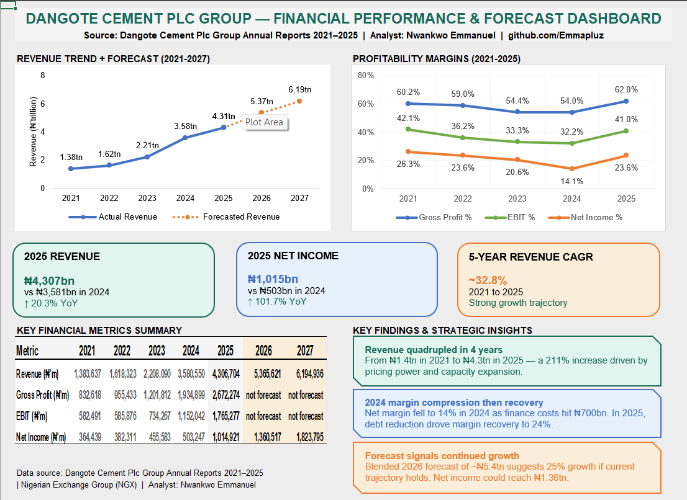

# Dangote Cement Group — Financial Analysis & Forecast
### Excel-based financial performance analysis and 
### revenue forecast (2021–2027)

**Analyst:** Nwankwo Emmanuel  
**Tools:** Microsoft Excel  
**Data Source:** Dangote Cement Plc Group Audited 
Financial Statements 2021–2025 — Nigerian Exchange 
Group (NGX)  
**GitHub:** [github.com/Emmapluz](https://github.com/Emmapluz)  
**Portfolio:** [View Full Portfolio](https://www.notion.so/Emmanuel-Nwankwo-Data-AI-Automation-Portfolio-34d2848d0dba80bd9f6fc5fd419f3c63)
**Medium:** [Read the Full Analysis Breakdown](https://medium.com/@e.u.nwankwo93/what-dangote-cements-numbers-actually-reveal-a-5-year-deep-dive-ef7e638543d2)

---

## Project Overview

This project analyses the financial performance of Dangote Cement Plc Group across five years (2021–2025) 
using official audited financial statements, and projects revenue and net income forward to 2027 using 
two forecasting methods.

As a certified financial analyst (365 Careers, Udemy 2025) with a background in health education and fintech 
operations, I built this analysis to demonstrate practical financial modelling skills using real 
Nigerian corporate data.

---

## Dashboard



---

## What Was Analysed

**Income Statement (P&L):**
- Revenue, gross profit, EBIT, net income (2021–2025)
- Year-on-year growth rates
- Profitability margins — GP%, EBIT%, net income%

**Balance Sheet:**
- Total assets, liabilities, equity (2021–2025)
- Asset growth and capital structure trends

**KPIs Calculated:**
- Return on Assets (ROA)
- Return on Equity (ROE)
- Gross profit margin
- EBIT margin
- Net income margin

**Liquidity Ratios:**
- Current ratio
- Quick ratio
- Days Sales Outstanding (DSO)
- Days Inventory Outstanding (DIO)
- Days Payable Outstanding (DPO)
- Net Trading Cycle

**Solvency Ratios:**
- Debt ratio
- Interest coverage ratio

**Forecast (2026–2027):**
- Method 1: FORECAST.LINEAR (Excel linear regression)
- Method 2: Average historical growth rate
- Blended forecast: average of both methods

---

## Key Findings

| Finding | Detail |
|---|---|
| Revenue quadrupled | ₦1.4tn (2021) → ₦4.3tn (2025), +211% |
| 5-year CAGR | ~32.8% annual revenue growth |
| 2024 margin compression | Net margin fell to 14% as finance costs hit ₦700bn |
| 2025 recovery | Net income doubled to ₦1tn, margins recovered to 24% |
| 2026 blended forecast | ~₦5.4tn revenue projected |
| 2027 blended forecast | ~₦6.2tn revenue projected |

---

## File Structure

```
dangote-cement-financial-analysis/
├── excel/
│   └── Dangote_Cement_Financial_Analysis.xlsx
├── charts/
│   └── dangote_cement_dashboard.png
└── README.md
```

---

## Data Sources

| Years | Source | Link |
|---|---|---|
| 2025 | NGX Audited Financial Statements | [View](https://doclib.ngxgroup.com/Financial_NewsDocs/DANGOTE_CEMENT_PLC_-_2025_AUDITED_FINANCIAL_STATEMENTS.pdf) |
| 2024 | Dangote Cement FY2024 Annual Report | [View](https://dangote.com/wp-content/uploads/2025/12/Dangote-Cement-Full-Year-2024-Account.pdf) |
| 2021–2022 | Dangote Cement 2022 Annual Report | [View](https://cement.dangote.com/wp-content/uploads/2023/02/DCP-FY-2022-Result-Statement.pdf) |

All figures sourced from Group consolidated financial statements within each report.
2023 figures sourced from 2024 report prior year comparatives.

---

## About the Analyst

Certified financial analyst transitioning into data analysis and AI automation. 
Background in health education and fintech operations (Moniepoint Microfinance Bank). 
Building expertise in Python, SQL, Power BI and n8n AI automation with a focus on health and finance businesses.

- 📍 Lagos, Nigeria
- 💼 [LinkedIn](https://www.linkedin.com/in/emmanuel-uchenna-nwankwo)
- 🗂️ [Portfolio](https://www.notion.so/Emmanuel-Nwankwo-Data-AI-Automation-Portfolio-34d2848d0dba80bd9f6fc5fd419f3c63)
- 💻 [GitHub](https://github.com/Emmapluz)
